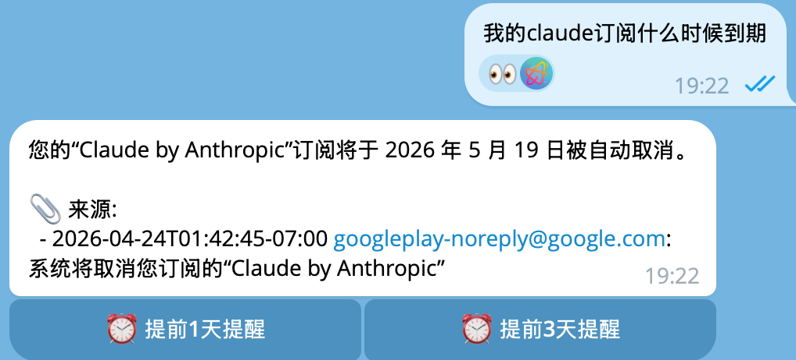

# PostOwl 🦉

智能邮件代理 — 自动分类、摘要、RAG 问答、规则引擎，通过 CLI 和 Telegram Bot 管理你的邮箱。

Smart email agent — auto-classify, summarize, RAG Q&A, rule engine, manage your inbox via CLI & Telegram Bot.

---

## 特性 / Features

- **IMAP IDLE 实时推送** — 新邮件到达 30 秒内自动处理，无需轮询
- **并行 LLM 处理** — 60 并发分类 + 摘要，100 封邮件 30 秒完成
- **两阶段 RAG** — 先摘要筛选 top-20，再全文分析相关邮件，检索面广、token 成本低
- **分层记忆** — L1 索引（用户邮件世界概览）+ L2 联系人画像 + L4 向量归档
- **工作记忆** — Telegram 对话支持追问，30 分钟跨消息上下文
- **Listener 规则引擎** — 事件驱动，内置优先级通知 / 自动标签 / 回复提醒
- **自进化规则** — 检测用户重复操作模式，自动建议创建规则
- **智能提醒** — RAG 回答检测到截止日期时自动弹出"提前 1 天 / 3 天提醒"按钮
- **三级失败升级** — LLM 调用失败自动缩短 body 重试，不静默丢失
- **多收件人感知** — 支持按收件人地址搜索和过滤（集合邮箱场景）
- **独立 Embedding 配置** — LLM 和向量化可以用不同提供商

## 快速开始 / Quick Start

### 安装 / Install

```bash
git clone https://github.com/Rladmsrl/postowl.git
cd postowl
uv sync
```

### 配置 / Configure

```bash
# 交互式配置（LLM API、Embedding API、Telegram Bot）
uv run postowl init
```

或手动复制 `config.example.yaml` 到 `~/.postowl/config.yaml`：

```yaml
llm:
  base_url: "https://api.deepseek.com"
  api_key: "sk-xxx"
  chat_model: "deepseek-chat"

embedding:
  base_url: "https://dashscope.aliyuncs.com/compatible-mode/v1"
  api_key: "sk-xxx"
  model: "text-embedding-v4"

telegram:
  bot_token: "123456:ABC-DEF"
  allowed_user_ids: [your_user_id]

scheduler:
  fetch_interval_minutes: 10
  max_workers: 60
  use_idle: true
```

LLM 和 Embedding 支持不同提供商，环境变量可覆盖配置文件：

```bash
export POSTOWL_LLM__API_KEY=sk-xxx
export POSTOWL_EMBEDDING__API_KEY=sk-xxx
```

### 添加邮箱 / Add Email Account

```bash
uv run postowl accounts add
# 按提示输入：名称、邮箱地址、IMAP 服务器、密码
# 密码存入系统密钥链（macOS Keychain / Linux Secret Service），不落盘
```

### 使用 / Usage

```bash
# 拉取并处理新邮件（首次超过 1000 封会提示选择数量）
uv run postowl fetch

# 指定拉取数量
uv run postowl fetch --limit 500

# 今日邮件摘要
uv run postowl summary --period today

# 搜索邮件
uv run postowl search "发票"

# RAG 问答（支持追问）
uv run postowl ask "最近有什么需要续费的服务？"

# 设置提醒
uv run postowl remind "2025-06-15T10:30" "IEPL 流量即将到期"

# 启动 Telegram Bot + IDLE 实时监听 + 定时任务
uv run postowl serve
```

## Telegram Bot 命令 / Bot Commands

| 命令 | 说明 |
|------|------|
| `/fetch` | 拉取新邮件 |
| `/today` | 今日邮件摘要 |
| `/week` | 本周邮件摘要 |
| `/ask <问题>` | RAG 问答 |
| `/search <关键词>` | 搜索邮件 |
| `/categories` | 分类统计 |
| `/remind <时间> <内容>` | 设置提醒 |
| `/reminders` | 查看待办提醒 |
| `/accounts` | 查看邮箱账户 |
| `/listeners` | 查看规则列表 |
| `/listener_toggle <id>` | 启停规则 |
| `/create_rule <handler> <domain>` | 创建自动规则 |

直接发文字消息 = RAG 问答，支持上下文追问。

RAG 回答如果检测到截止日期，会自动弹出提醒按钮：

<div align="center">
  
</div>

## 架构 / Architecture

```
PostOwl 🦉 邮件处理流程:

  📬 新邮件到达 (IMAP IDLE / 轮询)
    │
    ├─ 拉取 + 存入 SQLite
    ├─ 并行 LLM 处理 (ThreadPoolExecutor)
    │   ├─ 分类: category, priority, suggested_action, confidence
    │   └─ 摘要: 中文摘要, 截止日期, 金额提取
    ├─ 向量索引 (ChromaDB)
    ├─ Listener 引擎触发
    │   ├─ priority_notifier → Telegram 通知
    │   ├─ auto_label → 自动标签
    │   └─ reply_reminder → 回复提醒
    ├─ L1 记忆索引刷新
    └─ 自进化规则检查

  💬 用户问答 (Telegram / CLI)
    │
    ├─ 注入 L1 记忆索引 + 工作记忆
    ├─ Phase 1: 向量检索 top-20 → 摘要筛选
    ├─ Phase 2: 相关邮件全文 → LLM 回答
    └─ 检测截止日期 → 弹出提醒按钮
```

```
src/postowl/
├── cli.py              # Typer CLI 入口
├── app.py              # 生命周期编排（Bot + Scheduler + Listener + Memory）
├── bot.py              # Telegram Bot（命令、工作记忆、提醒按钮）
├── pipeline.py         # 统一处理流水线（并行 LLM + 串行写入）
├── scheduler.py        # IMAP IDLE 实时推送 + 轮询降级
├── config.py           # Pydantic Settings + YAML 配置
├── models.py           # 数据模型
├── agent/
│   ├── classifier.py   # 分类（含三级重试）
│   ├── summarizer.py   # 摘要（含三级重试）
│   ├── rag.py          # 两阶段 RAG 引擎
│   └── retry.py        # 通用重试升级策略
├── email/
│   ├── client.py       # IMAP 客户端（含 IDLE + headers-only）
│   └── parser.py       # MIME 解析
├── llm/
│   └── client.py       # OpenAI 兼容 LLM 客户端
├── storage/
│   ├── database.py     # SQLite（7 张表）
│   └── vectorstore.py  # ChromaDB 向量存储
├── memory/
│   ├── index.py        # L1 记忆索引
│   ├── contacts.py     # L2 联系人画像
│   └── working.py      # 工作记忆（对话上下文）
└── listener/
    ├── engine.py       # 事件驱动规则引擎
    ├── builtin.py      # 内置 Listener
    └── learner.py      # 自进化规则学习器
```

## 兼容 LLM 提供商 / Compatible LLM Providers

PostOwl 🦉 支持任何 **OpenAI 兼容** API：

| 提供商 | base_url |
|--------|----------|
| OpenAI | `https://api.openai.com/v1` |
| DeepSeek | `https://api.deepseek.com` |
| Google Gemini | `https://generativelanguage.googleapis.com/v1beta/openai/` |
| 阿里百炼 | `https://dashscope.aliyuncs.com/compatible-mode/v1` |
| Ollama (本地) | `http://localhost:11434/v1` |

Embedding API 可以独立配置不同的提供商。

## 数据存储 / Data Storage

所有数据存储在 `~/.postowl/` 下：

| 文件 | 内容 |
|------|------|
| `config.yaml` | 配置文件 |
| `postowl.db` | SQLite（accounts, emails, reminders, listeners, memory_layers, contacts, user_actions） |
| `chroma/` | ChromaDB 向量索引 |
| 系统密钥链 | 邮箱密码（不落盘） |

## 开发指南 / Contributing

详见 [CONTRIBUTING.md](CONTRIBUTING.md) — 包含完整的项目结构、核心流程、代码规范、扩展指南和故障排查，适用于 AI Agent 和开发者。

## 灵感 / Inspiration

PostOwl 🦉 的分层记忆、自进化规则、工作记忆、失败升级策略等设计灵感来自 [GenericAgent](https://github.com/lsdefine/GenericAgent) — 一个自进化的通用智能体框架。

## ⭐ 支持 / Support

如果这个项目对你有帮助，欢迎点一个 **Star!** 🙏

If this project is helpful to you, please give it a **Star!** 🙏

## 🚩 友情链接 / Links

- [GenericAgent](https://github.com/lsdefine/GenericAgent) — 自进化通用智能体框架，PostOwl 🦉 的灵感来源

[](https://linux.do/)

## 📄 许可 / License

MIT License — 详见 [LICENSE](LICENSE)
